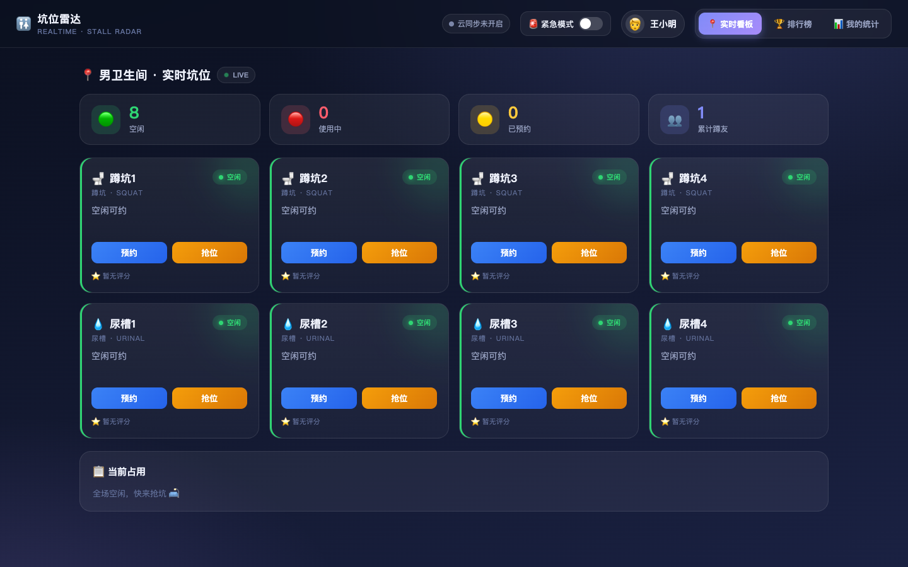
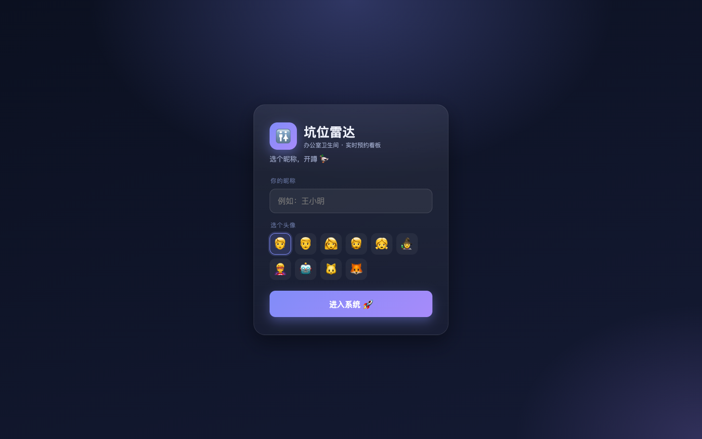
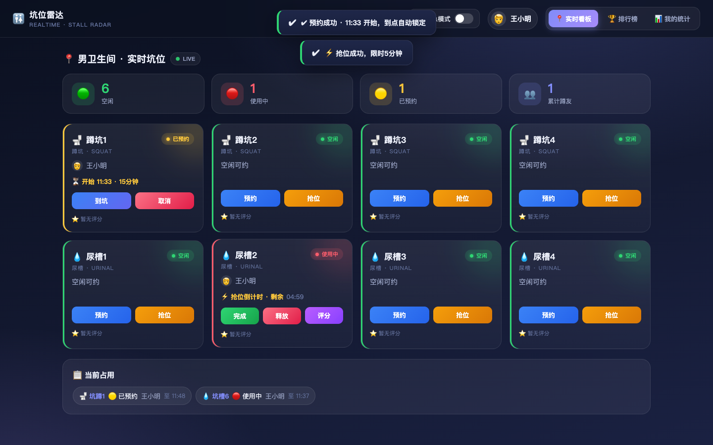
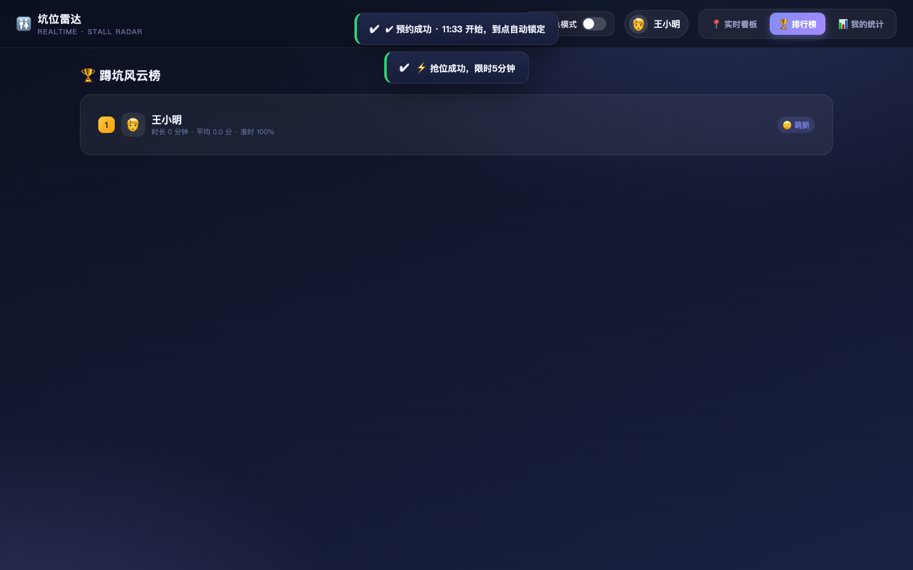
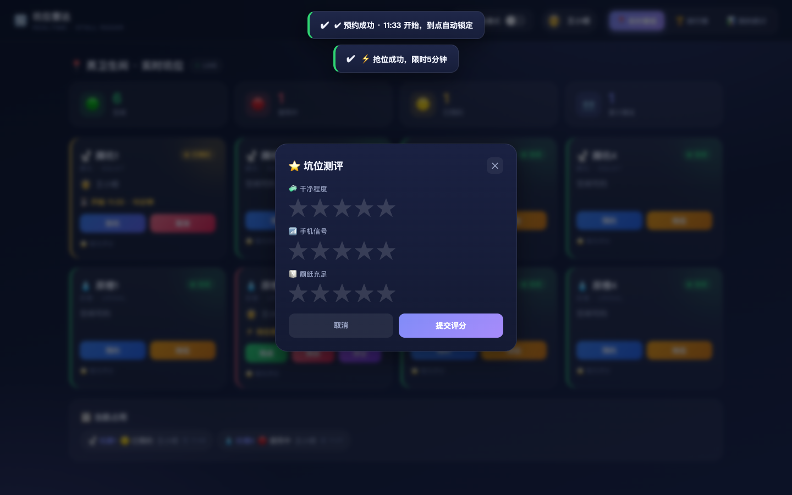
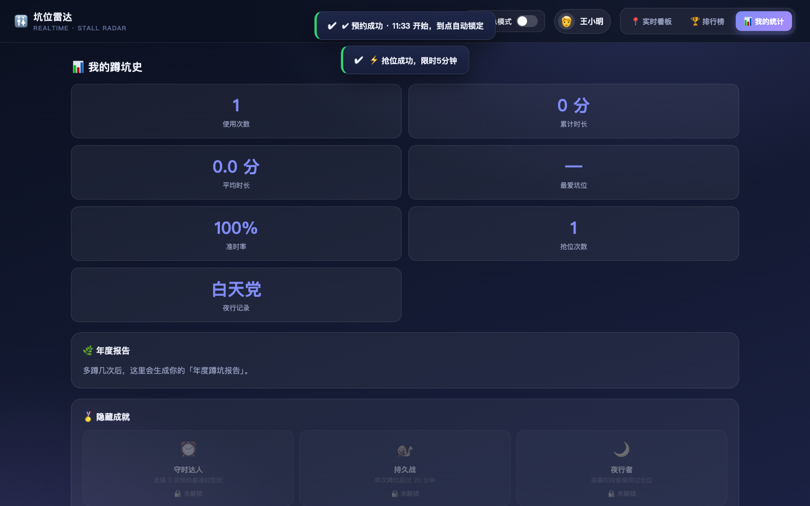

# 🚻 坑位雷达 · 办公室卫生间实时看板

> 一个给办公室/部门用的卫生间坑位预约与实时看板：预约、抢位、催促、评分、成就与排行榜，全部实时同步。

多人在同一局域网打开即可使用。**账号全局唯一，用户名允许重名**——当同一空间里出现重名用户（比如三四个「王伟」）时，系统会自动在名字后追加账号、并用稳定的颜色圆点＋头像圆环把他们区分开。

---

## ✨ 功能一览

| 能力 | 说明 |
| --- | --- |
| 空间看板 | 任意创建/加入「厕所空间」，每空间独立配置蹲坑/尿槽数量 |
| 账号体系 | 账号唯一、大小写敏感，密码 scrypt 加盐哈希，会话用 token |
| 预约 / 抢位 | 预约到点锁定；着急可抢空闲坑位（尿槽 1 / 蹲坑 5 分钟倒计时） |
| 催促 | 蹲太久别人可催促，本人收到提醒，超时自动释放 |
| 评分 | 干净度 / 信号 / 纸巾 三维评分，展示在每个坑位 |
| 排行榜 + 成就 | 按时率、时长、蹲坑次数等维度排名，可解锁徽章 |
| 重名区分 | 用户名可重名；按账号区分身份，展示名追加账号 + 彩色标识 |
| 个人统计 | 累计时长、最爱坑位、准时率等趣味年度报告 |

支持桌面与手机两种布局（响应式）。



<details>
<summary>查看更多界面截图</summary>

| 登录 | 使用中看板 | 排行榜 | 评分 | 个人统计 |
| --- | --- | --- | --- | --- |
|  |  |  |  |  |

</details>

---

## 🧱 技术栈

- **后端**：Node.js + Express + `ws`（WebSocket 实时推送）
- **存储**：PostgreSQL（可选）；连接失败时自动降级为进程内内存模式，适合本地演示
- **前端**：原生 HTML / CSS / JS 单页（无构建步骤），静态文件由 Express 托管
- **部署**：Dockerfile + docker-compose

> 说明：PostgreSQL 主要负责持久化「空间 / 战绩 / 评分」，运行状态（坑位占用、预约、在线用户）实时保存在内存并由 WebSocket 广播。

---

## 📁 项目结构

```
坑位雷达/
├── server.js                # 后端：HTTP + WebSocket + 业务逻辑
├── public/
│   └── index.html           # 前端单页应用（原生三件套）
├── test/
│   └── test.js              # 端到端冒烟测试（需先启动服务）
├── docs/
│   └── screenshots/         # 界面截图（供 README 使用）
├── Dockerfile               # 后端容器镜像
├── docker-compose.yml       # 一键本地启动
├── package.json
├── .dockerignore
└── .gitignore
```

---

## 🚀 快速开始

### 方式一：直接运行（推荐）

```bash
npm install        # 安装依赖
npm start          # 启动，默认 http://localhost:3000
```

浏览器打开 http://localhost:3000，注册一个账号即可。

### 方式二：Docker

```bash
docker compose up -d --build
# 打开 http://localhost:3000
```

### 可选：连接 PostgreSQL

默认会尝试连接 `127.0.0.1:5432`（用户 `postgres`、库 `toilet`、密码 `toilet_dev`）。连接失败会自动切到内存模式，不影响功能演示。可通过环境变量覆盖：

```
PGHOST / PGPORT / PGUSER / PGPASSWORD / PGDATABASE / PORT
```

---

## 🧪 运行测试

```bash
# 先在一个终端启动服务（内存模式即可）
npm start

# 另开一个终端跑测试
npm test
```

包含了账号唯一性、大小写敏感、预约/抢位/催促/评分、越权拦截，以及**重名用户名区分**等 60+ 项断言。

---

## 🔌 交互协议简述

前端通过单向 WebSocket（`/ws`）与后端通信，服务端按类型广播状态：

| 消息类型 | 方向 | 说明 |
| --- | --- | --- |
| `join` | 客户端→服务端 | 进入某空间（`spaceId`） |
| `login` | 客户端→服务端 | 账号+密码，或 `token` 恢复会话 |
| `register` | HTTP POST `/api/register` | 注册（账号唯一） |
| `reserve` / `cancel` | …… | 预约 / 取消预约 |
| `grab` / `startUse` / `finish` / `release` | …… | 抢位 / 到坑 / 完成 / 释放 |
| `urge` / `rate` / `toggleEmergency` | …… | 催促 / 评分 / 紧急模式 |
| `stalls` 等 | 服务端→客户端 | 全量推送坑位 / 用户 / 排行榜 |

身份模型：**坑位占用与战绩一律以全局唯一的 `account` 为身份键**；`display` 是发给前端的展示名（重名时自动追加账号，如 `王伟(ww1)`），并带 `dup` 标记与稳定的按账号颜色。

---

## 📝 命名约定

- **账号 `account`**：登录身份，全局唯一，大小写敏感。
- **用户名 `username`**：对外展示名，**允许重名**。
- **展示名 `display`**：服务端计算后下发的展示标签，重名时自动区分。
- **空间 `space`**：独立看板单元，各有坑位配置与运行状态。